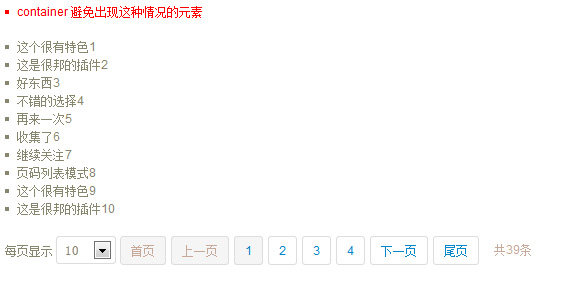

# jPager #

静态元素分页插件jPager

# jPager效果图 #

# 参数 #

* @config {string} 			    container 操作container下面的children

* @config {string} 			    position 分页显示的位置； after: 在内容的后面，before: 在内容的前面

* @config {Boolean} 			showLength 首否显示总共多少条；true: 显示共多少条信息, false: 不显示

* @config {Boolean} 			showSelect 是否显示选择下拉框；true: 显示下拉框选择条数, false: 不显示

* @config {int} 			    perPage 每页显示多少条信息, 这里的信息是从select里面取

* @config {array}               select 下拉框的信息，这个是showSelect为true时设置才有效 [10, 20, 50, 100]

* @config {int} 			    activePage 默认显示哪一页

 * @config {object}             textmap: {
									first: "首页",
									last: "末页",
									prev: "上一页",
									next: "下一页"
								}
								
 * @config {string}             children 孩子元素

# 使用方法 #

引用css, js

<code html>
&lt;link rel="stylesheet" type="text/css" href="jPager/jPager.css"&gt;

&lt;script type="text/javascript" src="jPager/jquery-1.8.0.js"&gt;&lt;/script&gt;

&lt;script type="text/javascript" src="jPager/jquery.jPager.js"&gt;&lt;/script&gt;
</code>

<code javascript>
	$("#infoContainer").jPager({container : "#info"});

</code>

# 高级方法 #

<code javascript>
	$("#infoContainer").jPager({
	
		container: "#info",
		
		position: "after",  
		
		showLength: true,  
		
		showSelect: true,
		
		showAction:true,  
        
		perPage: 10,  
		
		select: [10, 20, 50, 100],
		
		activePage: 1, 
		
		textmap: {
			first: "首页",
			last: "末页",
			prev: "上一页",
			next: "下一页"
		},   
		
		children: "li"                
	});
</code>

# demo #

<a href="http://joannamo.github.com/jPager/index.html">jPager</a>

	
